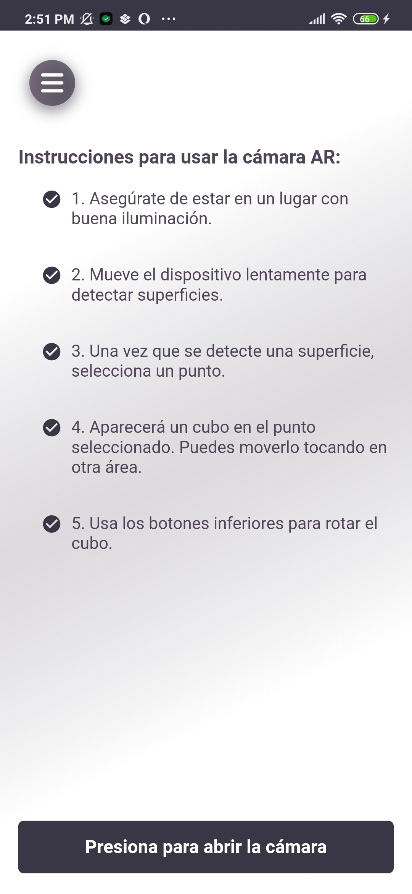
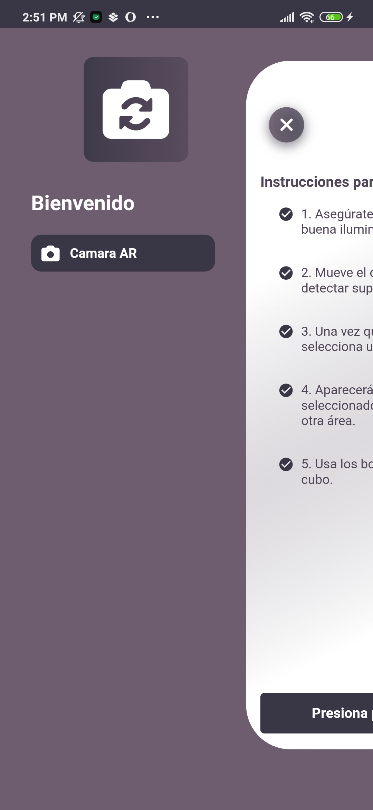
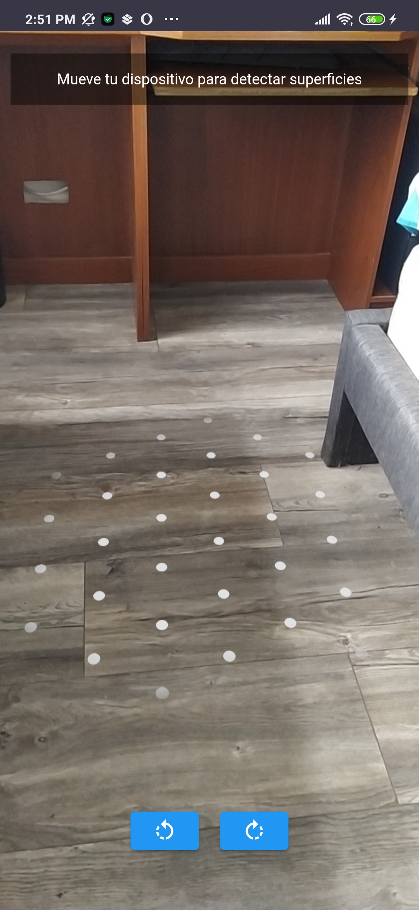
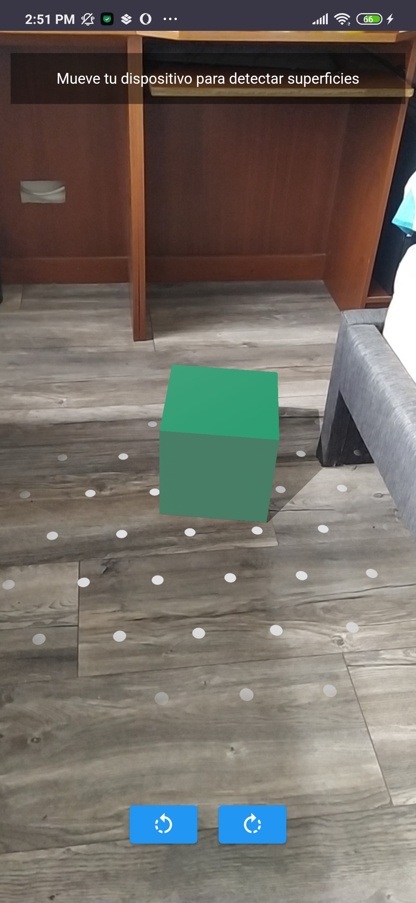
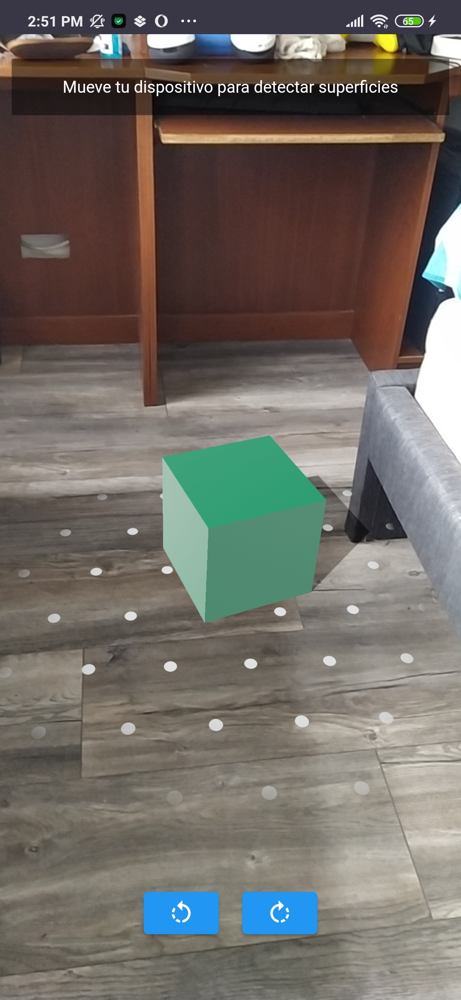
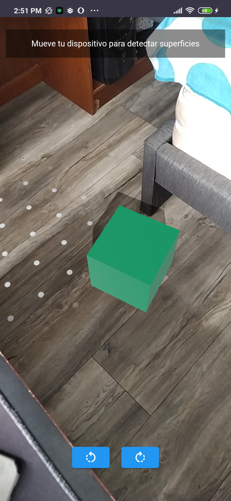
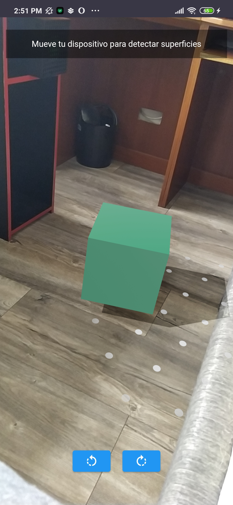
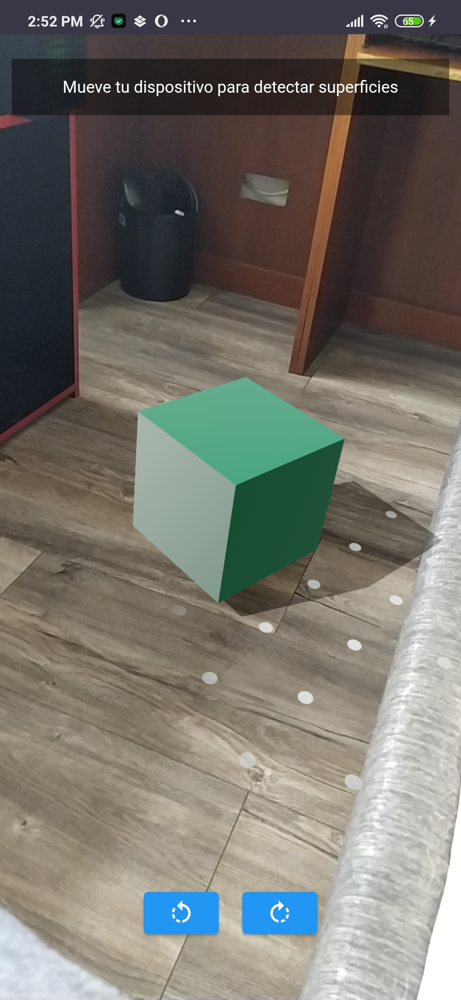

# GitHub Commit History

GitHub Commit History is a project with both frontend and backend components. This section provides details about the both.

<p align="center">
  <a href="https://github.com/cristiancamilo070/camera_ar" target="_blank">
    
  </a>
  <a href="https://github.com/cristiancamilo070/camera_ar" target="_blank">
    
  </a>
  <a href="https://github.com/cristiancamilo070/camera_ar" target="_blank">
    
  </a>
  <a href="https://github.com/cristiancamilo070/camera_ar" target="_blank">
    
  </a>
  <a href="https://github.com/cristiancamilo070/camera_ar" target="_blank">
    
  </a>
  <a href="https://github.com/cristiancamilo070/camera_ar" target="_blank">
    
  </a>
  <a href="https://github.com/cristiancamilo070/camera_ar" target="_blank">
    
  </a>
  <a href="https://github.com/cristiancamilo070/camera_ar" target="_blank">
    
  </a>
  <a href="https://github.com/cristiancamilo070/camera_ar" target="_blank">
    
  </a>
</p>

## Running the Flutter Project Locally

To run this Flutter project locally, follow these steps:

- Make sure you have Flutter and Dart installed on your machine.
- Clone the GitHub repository to your local machine using the following command:

```bash
git clone https://github.com/cristiancamilo070/camera_ar.git
```

- then run

```bash
flutter pub get
```

```bash
flutter run
```

# Frontend Overview

<div style="display: flex; justify-content: space-between;">
  
  
</div>
<div style="display: flex; justify-content: space-between;">
  
  
</div>
<div style="display: flex; justify-content: space-between;">
  
  
</div>
<div style="display: flex; justify-content: space-between;">
  
 
  >
</div>

## Clean Architecture and Code

This Flutter frontend follows the principles of Clean Architecture and Clean Code, providing a structured and maintainable codebase.

## User Functionality

    •	AR Plane Detection: The app uses ARCore to detect horizontal planes in the environment.
    •	3D Object Placement: Users can place a cube on a detected plane.
    •	Object Interaction: Users can interact with the cube, rotating it using buttons or moving it by tapping another area on the plane.
    •	Clean Architecture: The project is built following the principles of Clean Architecture, ensuring a modular and maintainable codebase.
    •	Test Coverage: Basic unit and widget tests have been implemented to validate core functionalities.

### Splash Screen

A Splash Screen is implemented to enhance the user experience by displaying a visual indication that the app is loading.
